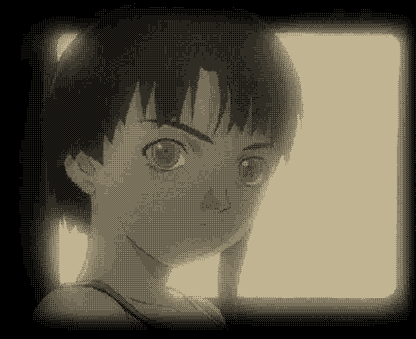

# 兴趣

我喜欢很多东西。

---

## 数学及元数学
请注意：为了避免对定义权不必要的争夺，我声明如下：我认为**计算数学不是数学**。

- 数学：各个方向都挺感兴趣，目前主要学习拓扑、代数、范畴论。
- 元数学：类型论、逻辑、集合论、数学哲学。

## 文学

请和我讨论文学吧！有文学存在，我感觉这世界是幸福的！我什么种类的书都读，我喜欢很多作家，读他们的文字就像在偷窃一样，那样美妙的语句就这样被我看到了，那样震撼人心的思想就这样被我拿在手中、这样轻轻地被我读着！

杜拉斯、老舍、巴金、卡尔维诺、贝克特、穆齐尔、卡夫卡、陀思妥耶夫斯基、波拉尼奥、布鲁诺、阿莱杭德娜、萨瓦托、博尔赫斯、川端康成、迪伦马特、海子……

还有许多、许多人……

## 计算机

- 函数式编程；
- 编程语言理论：指称语义、Domain 理论；
- 定理证明器；

另外，我喜欢九十年代的网络文化：扑朔迷离、带有恐怖色彩。

## 语言
- 娱乐学习：
  - 世界语；
  - 俄语；
- 严肃学习：
  - 古代汉语。

## 游戏
- 心理恐怖；
- 元游戏；
- 卡牌；

## 文化及文化现象
- 宗教：
  - 道教；
  - 佛教；
  - 印度教；
- 历史：
  - 先秦史；
  - 世界近代史；
- 独立出版
- 各种主义：上世纪令人热血沸腾的思潮已不可挽回地消逝了。
