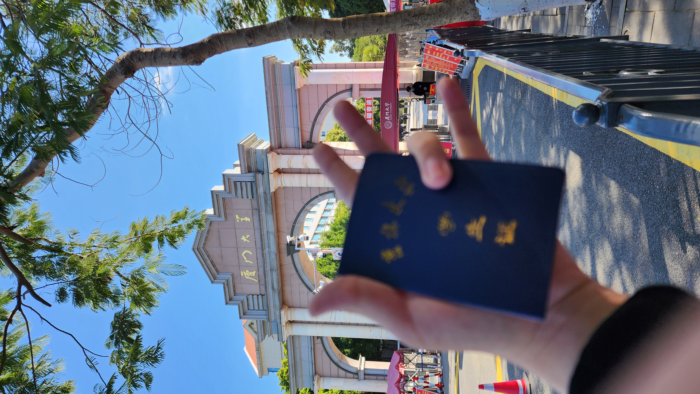
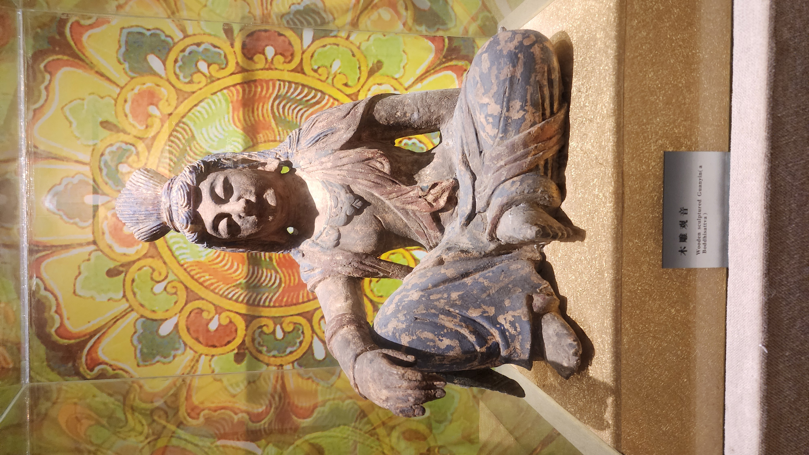
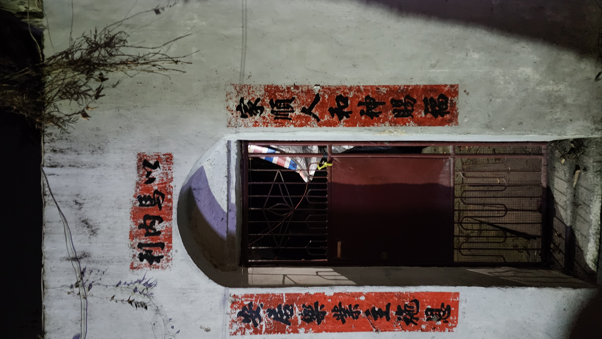

## 厦门、泉州、潮州游记及其他

从学校回来修整两天，我便前往厦门旅游。我对厦门没有什么兴趣，基本上是陪父母旅游，但是泉州却给我留下了很深刻的印象。潮州则是返程中的“歇脚处”。

### 厦门
这是老爸曾经工作的地方。来了这里才知道厦门的管辖范围不止厦门岛，不过作为游客，我所涉足的地区无非厦门岛及鼓浪屿而已。

厦门岛上乏善可陈，对北方人来说可能有一定新意：沙滩、常绿树、大海。但对于我来说就没啥意思，名胜古迹寥寥无几、文化场所除了厦大及南普陀寺以外就没啥了。厦大进不去，但毕竟还是拍了张相片：

南普陀寺很大，里面石碑、题词甚多，不过限于时间（妹当然觉得没意思），匆匆瞥了几眼，没看到许多东西，浮光掠影间有几块石头值得注意，它们诉说着清朝时候外国人来游览的故事。时间够的话应该再多玩赏一番。

鼓浪屿很美。岛上到处是名宅，气派十足，但因各种原因——有历史纪念意义云云——又不对游客开放，相较之下，诚哉苏子之言“惟江上之清风，与山间之明月，耳得之而为声，目遇之而成色，取之无禁，用之不竭”，其实在我心中，游览鼓浪屿的最佳方案就是躺在码头旁的草地上，呆呆地躺一下午。岛中央应当还有个故宫分馆，专展清朝外国器物，要门票就没去。

关于厦门的景点，也就这么多了。此次旅行印象最深的反倒是厦门城市的生活气息，不论是厦门岛还是鼓浪屿，都有浓厚的生活气息：厦门岛上十字路口的行人、街头的大众食堂、鼓浪屿上下午放学玩乐的小学生（巴掌大的鼓浪屿居然还有小学！）……

### 泉州
本行程最惊喜的地方！作为海上丝绸之路起点的福州，宗教氛围浓厚：
  - 泉州大清真寺：中国四大回回寺之一（广州也有一座——怀圣寺），但可惜没去；
  - 南少林寺：和河南少林寺遥相呼应（刚在网上搜发现福建竟有三座少林寺）；
  - 大开元寺：传奇级别的寺庙，里边竟然还有印度教的刻像（可惜没找到）；
    

  - 草庵寺：地球上唯一一座摩尼教寺庙！
  - 开元寺旁边就是基督教堂

泉州博物馆也令人惊喜不已，内容非常丰富，介绍了泉州名人（譬如李贽）、宗教、语言（展出了许多福建方言课本，南洋诸语中的闽语借词）等等。

依泉州博物馆的告示，这里还曾存在犹太教。

除此以外便是西街，不过我对小吃不感兴趣，因此略过不提。

### 潮州
去广济桥看了灯光秀，吃了牛肉火锅（美味），除此之外也没啥了。

---

寒假回来终于开始读《金瓶梅》，非常好看！书中淫诗非常精彩（“涓涓露滴牡丹心”、“喜时吐舌开颜笑”等等），潘金莲也令人想入非非 :D。

此外在老家快把《古代汉语》第一册读完了，也蛮有成就感的。

---

二〇二五年二月二十五日补记：充分体现潮汕、福建一带宗教氛围的有趣对联：

